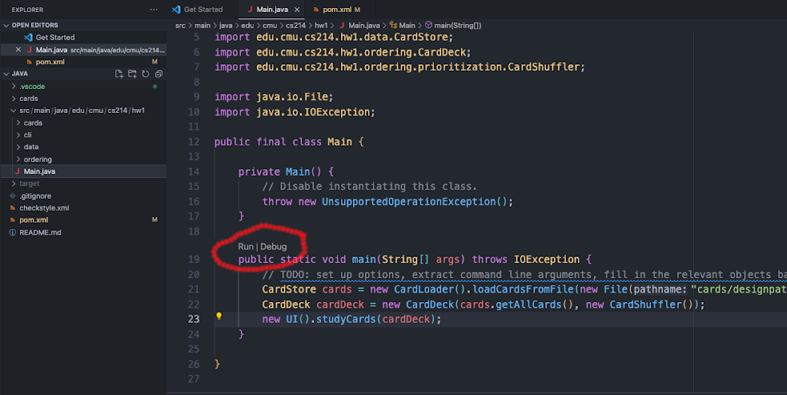
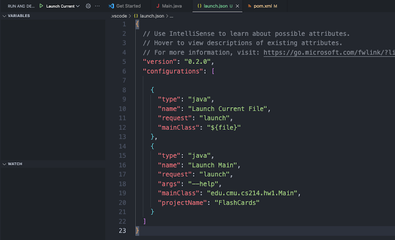

# Lab 2: Java Tooling and GitHub Actions

After TypeScript in Lab 1 we now explore Java tools and dive deeper into *git* and GitHub actions.


## Deliverables

- [ ] Install Java 17, maven, and an IDE of your choice. Run `java --version` to verify it is version 17. Show that you can compile and run the Java starter code of homework 1 on your machine.
- [ ] Automate the Java build of the homework 1 starter code with GitHub actions.
- [ ] Demonstrate your understanding of good commit practices with the commits introducing the GitHub action.


## Good Git Practices 

Recall good practices for git and commit messages from the lecture. Good practices help you and other engineers understand your development process. Especially:

- Make clean, single purpose commits.
- Leave meaningful but concise commit messages. 
- Commit early, commit often
- Don’t alter published history
- Don’t commit generated files 

Demonstrate those practices with all commits you do in this lab (and also in all future homework assignments).


## Java Setup

### Installing Java 

Download and install Java 17. The language used in this class is Java 17. Several vendors provide implementations of Java 17, if in doubt choose the open-source OpenJDK 17. 

Installing the right version of Java can sometimes be a bit tricky. If you already use a package manager for your platform (homebrew, apt, snap, scoop, etc) installing Java with that tool is probably the easiest. Below are detailed instructions, but feel free to skim/skip.

*Note for Windows users:* We recommend installing [WSL](https://learn.microsoft.com/en-us/windows/wsl/install) (Windows Subsystem for Linux) and using it for all your development environments installations and future assignments when following this guide. 

**Installing Java using homebrew on MacOS.** Run `brew install openjdk@17` and run the command from the output to create a symbolic link. See [these instructions](https://medium.com/@manvendrapsingh/installing-many-jdk-versions-on-macos-dfc177bc8c2b) for a detailed reference.

**Manual installation and other operating systems.** 

- MacOS. Download the MacOS tar.gz archive from the [OpenJDK website](https://jdk.java.net/archive/). Untar the archive (double click), and move the contained directory (named something like jdk-17.0.2.jdk) to the /Library/Java/JavaVirtualMachines/ directory
- Linux. If possible, please really use the package manager of your distribution. It will be much easier.
- Windows. To install OpenJDK, download the Windows zip file from the [OpenJDK website](https://jdk.java.net/java-se-ri/17), and follow the instructions at [this StackOverflow post ](https://stackoverflow.com/questions/52511778/how-to-install-openjdk-11-on-windows/52531093#52531093)to correctly set Windows environment variables. Alternatively, if you wish to just use an install wizard, [download and install the Oracle JDK](https://www.oracle.com/java/technologies/javase-jdk16-downloads.html).

**Managing multiple Java installations.** If you already have existing different versions of Java installed and want to keep them, you can use [jEnv](http://jenv.be) to help manage your installations. As another option, you can set the JAVA_HOME environment variable in your ~/.zshrc or ~/.bash_profile or Windows configuration to point to Java 17 folder (e.g., `export JAVA_HOME=$(/usr/libexec/java_home -v17)`; if you choose this approach, you’ll need to modify the number that comes after -v if you ever want to switch your Java version). If you’re interested in switching between Java versions (not needed in this course), see [here](https://medium.com/@manvendrapsingh/installing-many-jdk-versions-on-macos-dfc177bc8c2b) under the section “Switching JDKs” for instructions on how to do so. 

*Checkpoint:* Confirm your Java installation by inspecting the output of the command `java -version` and `javac -version`. You should see something similar to: *openjdk version "17.0.2" 2022-01-18.* The major version should be 17, any vendor and patch version is okay. 

### Installing Maven

We use Maven as the build tool and package manager for Java in this course. Install a recent version of Maven. You can follow the instructions in [this link](https://www.baeldung.com/install-maven-on-windows-linux-mac) and verify that Maven 3.8.7 or newer is installed.[^1] More information about Maven can be found [here](https://maven.apache.org/what-is-maven.html).

For Mac users, you might find it easiest to install maven using homebrew: `brew install maven`

Explore the `pom.xml` file to see how the project is currently configured.

*Checkpoint:* In your local directory, try to run `mvn install` which will download dependencies and compile the code. You can either type `mvn install` in the terminal or click the Maven tab on the bottom left, scroll down to “install” and press the triangle.

### VSCode for Java

VSCode supports also Java. We recommend VSCode for development in both Java and TypeScript, but you are free to chose others. While IntelliJ and Eclipse are more advanced if you are solely developing in Java, using VSCode for both will save you from having to switch between IDEs which can be tedious. 

**Navigate to the sidebar and look for the extensions symbol (5th from the top) and search for “Extension Pack for Java” and install it locally**. This extension includes linting, test running and debugging, support for Maven (the build automation tool we use for Java projects in this class), and a few other helpful extensions. 

You need to have Java 17 installed for this project. Do not downgrade your Java version if you are asked to, this will break your project. 

*Checkpoint:* You can explore the source files in the IDE.

**Running a Java program in VSCode.** Once you have successfully opened the project and installed Maven, you should be able to view all the starter source files. Try building the program and run the main class.




To run a program go to the Main class (`Main.java`), you should see a *Run | Debug* prompt above the main method. Click *Run*. You will be able to view the run result at the bottom. You can interact with this program by replying on the console and hitting “enter”.

Alternatively, you can open the `Main.java` file and then open the *Run and Debug* tab on the left sidebar (4th from the top). Pressing Run and Debug will have the same effect as pressing Debug on the prompt above the main method. 

**Passing a command-line argument (you might find this helpful for HW1).** If you want to pass an argument to the program from within VSCode, click *“Create a launch.json file”*. This will open a file containing all of the run configurations. If you’d like to modify this in the future, you can find it in the .vscode folder. 



Under the configuration named `Launch Main`, you can add the attribute `args` and supply it with your arguments. For example `"args": "--help"`.  You can also supply multiple arguments in the same line: `"args": ["--arg1", "value1", "--arg2", "value2", …]`

For more information on launch configurations and Java debugging in VSCode, see [here](https://code.visualstudio.com/docs/editor/debugging#_launch-configurations).

### Checkstyle for Java

We preconfigured the project with the style checker *CheckStyle*. It is automatically executed as part of compiling and packaging the project with `mvn site (on the command line or in the IDE).

If you’d like to be able to run checkstyle through VSCode’s UI, you can search for and install the [“Checkstyle for Java” extension](https://code.visualstudio.com/docs/java/java-linting#_checkstyle).  To use this extension: Right click the `checkstyle.xml` file and select *“Set the Checkstyle Configuration File”* . Then right click on the file you want to check and select *“Check Code with Checkstyle”*. You can view the checkstyle violations on the problems tab near your terminal. 

*Checkpoint*: Test Checkstyle by renaming one method to start with a capital letter (against Java's style guidelines) and it should complain. A neat thing that this plugin does is automatically lint your code as you write it. You can test this out by opening the “problems” tab and making further changes.


## GitHub Actions

[Familiarize yourself with GitHub Actions](https://docs.github.com/en/actions). GitHub Actions can execute commands on your repository each time you push on a machine in the cloud. It can update status trackers if the build fails and provides detailed logs to find issues in. It will also email you if one of your builds fails, for easy tracking. These tools enable you to maintain the integrity of your code as you extend it. You can check the output of the latest build by clicking Actions under your repository name. 

The file `.github/workflows/typescript.yml` contains the instructions to run the TypeScript compiler after every push and this has been running for past pushes in your project already. Look at the results of those executions on GitHub in the *Actions* tab.

Now set up a similar build action for Java. You can simply copy and modify the typescript setup. Instead of a machine with *node* (`actions/setup-node@v2`) you want to use a Java 17 machine:

```yml
      # Checks-out Java
      - uses: actions/setup-java@v2
        with:
          distribution: microsoft
          java-version: 17
```

And you can run the entire build including tests and checkers with the `mvn site`  command (please keep the 2m timeout that we do not unnecessarily burn resources if something goes very wrong):

```yml
      # Runs type checker for Java files
      - name: Run on Java files
        run: |
          cd java
          timeout 2m mvn -f pom.xml site
```

*Checkpoint:* Commit and push the new GitHub Actions instructions for Java and observe how on GitHub the Java build is now executed *in addition* to the TypeScript build.


[^1]: If you choose to use the instructions linked, the `chown -R root:wheel Downloads/apache-maven*`command should actually be `sudo chown -R root:wheel Downloads/apache-maven*`. If you run into issues with adding Maven to your environment path, try using `~/.zshrc` instead of `~/.zshenv`.

