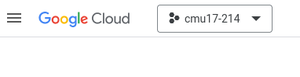
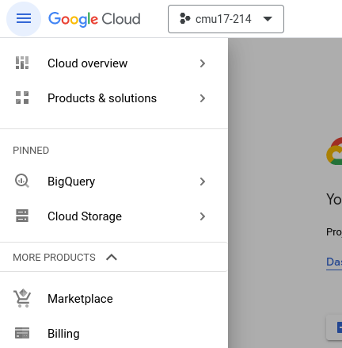

# Lab 8: Concurrency

# These instructions as written do not work. We are testing an alternative and will post an announcement on Piazza when they are fixed.

Homework 5 involves calling external APIS, specifically the [Google Cloud Vision API](https://cloud.google.com/vision?hl=en). This specific API (and many others you will encounter) requires you to set up an account. In this lab, you will set up your environment to work with the Google Cloud API. Since this lab is about environment setup, you may work through any problems you encounter with others, or seek help from the TAs during your lab session.

## Deliverables
- [ ] Sign up for an account and successfully make a call to the Google Cloud Vision API.
- [ ] Reimplement the Promise code in the repository as async/await.
- [ ] Identify a reason why async/await is preferred to Promises and explain it to the TA.

## Instructions
### Setting up a Google Cloud project.

1. First, download and install the gcloud CLI interface using the instructions [here](https://cloud.google.com/sdk/docs/install). Once you reach the step where you are asked to run `gcloud init`, run it, then continue following the instructions below. 
1. When asked for an account to use, _you must use your CMU email address_. If you do not, you will not be able to redeem the Google Cloud coupon that we provide you.
1. Create a new "project". This project is used by Google Cloud to organize your resources. This project will be used for both this lab and for Homework 5.
1. Log in with `gcloud auth login`.

### Redeeming your Google Cloud Education Credit Coupon
1. Click on the Student Coupon Retrieval Link in the assignment posted to Canvas
1. Verify your *school* email.
1. Click the redeem link in the email they send you.
1. In the window that is opened, enter the coupon code from the same email.

### Enabling billing for your project
1. Open a web browser and [sign in to the Google Cloud console](https://console.cloud.google.com).
1. Select the project you just created in the box in the upper-left corner of the screen (here, the project I created is called "cmu17-214"):

1. Open the context menu to the left of the "Google Cloud" logo, expand the drop-down that says "More Poducts", and select Billing:

1. You will get a screen that says "This project has no billing account". On this page click "Link A Billing Account".

1. In the popup, select the new billing account from the dropdown and select "Set Account".

### Enabling the Cloud Vision API

1. Enable the Google Cloud Vision API by following [this link](https://console.cloud.google.com/flows/enableapi?apiid=vision.googleapis.com) and following the prompts.

### Run and modify code

1. Clone the template repository <https://github.com/CMU-17-214/f2023-lab08> and follow the directions in the README.
