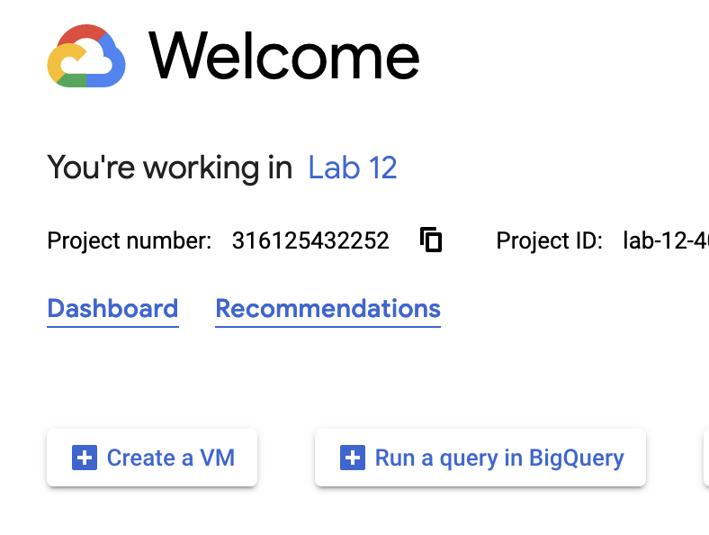

# Lab 12 - Cloud Deployment

Repo link: [https://github.com/CMU-17-214/f23-rec12](https://github.com/CMU-17-214/f23-rec12)

In this recitation, you will deploy a version of the TicTacToe game to the
Google Cloud Compute Engine service, allowing you to access it remotely.

## Deliverables
- [ ] Enable the Google Cloud Compute Engine service, and create a virtual machine.
- [ ] Demonstrate to the TA that you were able to successfully run an instance
      of TicTacToe on the cloud.
- [ ] Make a change to the code and update the image on the cloud.

## Introduction
One of the services provided by Google (and Amazon, Microsoft, etc.) is the
ability to use servers that they have as _virtual machines_. This allows you to
skip a lot of the work needed to assemble your own server, connect it to the
internet, and maintain hardware that might fail.

## Instructions

### Fork the starter repository

1. Create your own fork of [the starter repository](https://github.com/CMU-17-214/f23-rec12).

### Setting up a new virtual machine
Note: you may or may not have Google Cloud APIs enabled that you need for these
steps. If you do not, choose "Enable" when prompted.

1. On the [Google Cloud Console](https://console.cloud.google.com), click the
   "Create a VM" button.

1. Give your VM a name.

1. It is ok to use the default E2 machines, but under the "Machine type"
   dropdown select `e2-small`

1. Under "Firewall", select the boxes for "Allow HTTP traffic" and "Allow HTTPS
   traffic".

1. Click "Create".

1. You will be brought to a screen with a list of VM instances, and should see
your newly created VM, together with an "External IP" that you can use to
connect to it (in this case it's 34.69.81.171).

### Connecting to your virtual machine
Similar to lab 8 and homework 5, you will be using the Google Cloud CLI `gcloud`
to run these commands. If you do not have it set up properly, please refer back
to the lab 8 instructions.

1. On your local machine, run `gcloud init` to make sure you are logged in to
   the Google Cloud service.

1. Log in to your virtual machine with `gcloud compute ssh
   --project=[YOUR_PROJECT_NAME] [YOUR_VM_NAME]`

1. We will be using Docker to deploy this lab. Install the latest version of
   Docker on the remote machine using [the instructions
   here](https://docs.docker.com/engine/install/debian/#install-using-the-repository).

### Sign up for a Docker account and set up a new repository

1. Create a new account on [https://hub.docker.com](). This will be used for
creating Docker images and pushing them to Docker Hub for deployment to your new
virtual machine.

1. Sign in to Docker Hub. Once you are signed in select "Create repository". For
the name, select something reletavely memorable (e.g., "lab12"). We do not
recommend creating a private repository, or you will have to sign in to your
docker account on the virtual machine as well.

### Install Docker on your local computer

For this lab, we will be compiling, containerizing, and deploying an app to
Docker Hub locally so that they can be easily deployed to the cloud. Note: IF AT
ANY TIME YOU RUN INTO ISSUES HERE, PLEASE JUMP TO THE [EMERGENCY BAILOUT
INSTRUCTIONS](#emergency-bailout-instructions) below. These instructions are
tested and use the virtual machine itself for compilation and containerization,
which is a much less realistic use case, but should allow you to complete the lab.

1. Download the Docker Desktop installer from the [docker desktop
website](https://docs.docker.com/desktop/), and follow the instructions to
install it.

1. From Docker Desktop, sign in to your account using the credentials you
created in the previous step.

### Build and deploy a Docker container
1. On your local machine, clone the [repository we provide you]().

1. Navigate to the `back-end` directory and run `mvn package`.

1. Now navigate to the `front-end` directory and run `npm install` followed by
`npm run build`.

1. Navigate back to the root directory. From here run `docker build -t
[image-name] .` This will create a new Docker image.

1. Now create a new Docker tag matching your repository name. To do this run
`docker tag [image-name]
[dockerhub-user-name]/[repository-name]`. `[dockerhub-user-name]/[repository-name]`
should match your user name and the repository name you created on Docker Hub.

1. Check that the images you created exist with `docker images`. You should see
two images under the `REPOSITORY` column corresponding to the two you just
created.

1. Push the `[dockerhub-user-name]/[repository-name]` image to Docker Hub with
`docker push [dockerhub-user-name]/[repository-name]`.

### Pull the image from Docker Hub on the Google Cloud VM
1. Log back into the Google Cloud VM you created earlier.

1. Download the image you just pushed to Docker Hub using `docker pull
[dockerhub-user-name]/[repository-name]`. Check that it exists using `docker
images`.

1. Run the VM you just pulled with `docker pull -p 80:8080
[dockerhub-user-name]/[repository-name]`. You should see the message "Running on
port 8080!" if it is successful.

1. Navigate your web browser to the IP address of the container you created
earlier. You should see the same TicTacToe interface from Lab 7.

### EMERGENCY BAILOUT INSTRUCTIONS

If it turns out that you are having trouble setting up Docker locally, you do
have a virtual Linux machine that you can use to build the Docker
image. Although this is an unrealistic use case, you can get set up with a
container following these instructions.

1. Log in to the VM you started on Google Cloud. Since you'll be compiling on
the VM, you should first install the additional dependencies using `apt install
maven openjdk-17-jdk nodejs npm`.

1. Clone your fork of the starter repository to the Google Cloud VM.